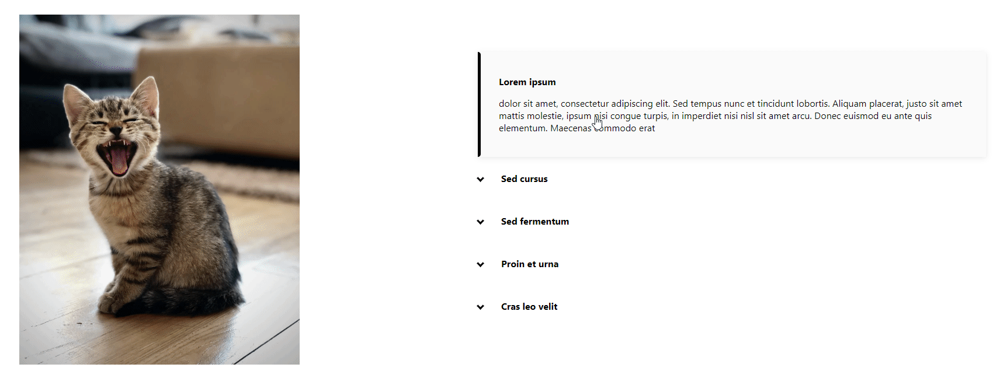

# react-card-with-image

> Cool react card component with image!

[](https://app.codacy.com/manual/cappydh/react-card-with-image?utm_source=github.com&utm_medium=referral&utm_content=cappydh/react-card-with-image&utm_campaign=Badge_Grade_Dashboard)
[](https://travis-ci.org/cappydh/react-card-with-image)
[](https://www.npmjs.com/package/react-card-with-image)
[](https://coveralls.io/github/cappydh/react-card-with-image?branch=master)

## Example



## Install

```bash
npm install --save react-card-with-image
```

## Usage

```jsx
import React from 'react'

import { CardView } from 'react-card-with-image'
import 'react-card-with-image/dist/index.css'

const App = () => {
  const items = [
    {
      id: 1,
      header: 'Lorem ipsum',
      description:
        'dolor sit amet, consectetur adipiscing elit. Sed tempus nunc et tincidunt lobortis. Aliquam placerat, justo sit amet mattis molestie, ipsum nisi congue turpis, in imperdiet nisi nisl sit amet arcu. Donec euismod eu ante quis elementum. Maecenas commodo erat',
      image: 'image-src'
    },
    {
      id: 2,
      header: 'Sed cursus',
      description:
        'in metus quis tempor. Donec at venenatis magna, vel fringilla dui. Curabitur id gravida ipsum. Donec at mollis massa. Nullam metus elit, pret',
      image: 'image-src'
    },
    {
      id: 3,
      header: 'Sed fermentum',
      description:
        'condimentum purus, non sagittis massa faucibus id. Sed finibus convallis lectus eu fringilla. Proin lacinia sem vitae nunc consectetur, a faucibus orci ultricie',
      image: 'image-src'
    },
    {
      id: 4,
      header: 'Proin et urna',
      description:
        'vitae neque fermentum fringilla. Proin bibendum sollicitudin aliquet. Fusce id magna aliquam, pulvinar metus vitae, bibendum felis.',
      image: 'image-src'
    },
    {
      id: 5,
      header: 'Cras leo velit',
      description:
        'finibus id eros eu, commodo sollicitudin lacus. Nunc semper enim nec est viverra, at pharetra orci lobortis. Nulla facilisi. Sed non lectus nunc.',
      image: 'image-src'
    }
  ]
  return (
    <CardView
      items={items}
      activeColor='#000'
      imageHeight='650px'
      imageWidth='800px'
    />
  )
}

export default App
```

## License

MIT © [cappydh](https://github.com/cappydh)
